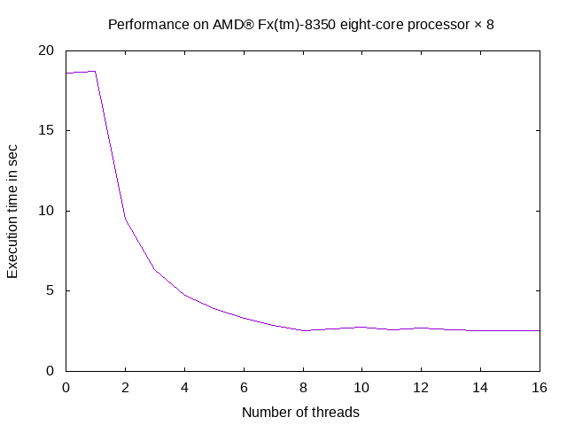
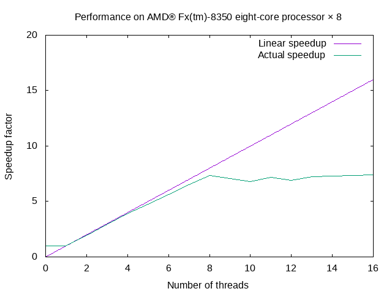

# ICE4131 - High Performance Computing (HPC)
## Lab 3: Parallelisation using Pthread
### Tutor: Franck Vidal

## Objectives

In this lab, you'll practice what we've seen in the lecture so far:
1. Parallelise some serial code using Pthreads,
2. Add timestamps to assess the execution time,
3. Run the code on the compute nodes
4. Plot graphs of runtimes and of speedups.

Some code is provided for your convenience:
- An image class (`Image`) is in `Image.h` and `Image.cxx`. Serial code is used.
- `PthreadImage` inherits of `Image`.

<!-- Link to create images of code: https://carbon.now.sh -->


## Getting the code

1. Download the code from Blackboard. The file is `Lab3-20191025.tar.bz2`.
2. Copy this file from your PC to `hawklogin.cf.ac.uk` using WinSCP.
3. Connect to `hawklogin.cf.ac.uk` using a SSH client such as Putty.
4. Create a `LAB3` directory using `mkdir`.
5. Go into `LAB3` using the `cd` command.
6. Extract the archive using:
```bash
$ tar xjvfp ../Lab3-20191025.tar.bz2
```

## Compiling the environment

1. Create a script to set your environment, e.g. `env.sh`. It should contain:
```bash
module load cmake
module load gnuplot
module load compiler/gnu/9/2.0
```
2. Set your environment using:
```bash
$ source env.sh
$
```
**You'll need to run this command EVERY TIME you log in.**
3. You can use
```bash
$ module list
```
to check that the modules are loaded.
4. Create a `bin` directory using `mkdir`.
5. Go into `bin` using the `cd` command.
6. Configure your project using CMake:
```bash
$ cmake ..
```
7. Compile your code
```bash
$ make
```

## Run your program

1. To run your program, launch a job. DO NOT RUN IT DIRECTLY ON `hawklogin.cf.ac.uk`. Be nice to other users!
2. See Lab 2.
3. Download ASCII image file from Blackboard.
4. Copy the image from your PC to `hawklogin.cf.ac.uk` using WinSCP. Make sure the file is in LAB3.
5. Uncompress the image:
```bash
$ bunzip2 ../Airbus_Pleiades_50cm_8bit_grey_Yogyakarta.txt.bz2
```
6. Create a new file named `submit.sh` containing:
```bash
#!/usr/bin/env bash
#

#SBATCH --job-name=my_test # Job name
#SBATCH --nodes=1                    # Use one node
#SBATCH --mem=600mb                  # Total memory limit
#SBATCH --time=00:15:00              # Time limit hrs:min:sec

./flip \
    -H  \
    ../Airbus_Pleiades_50cm_8bit_grey_Yogyakarta.txt \
    output_image.txt \
    $SLURM_CPUS_PER_TASK
```
7. To launch it, use:
```bash
$ sbatch  --account=scw1563 -c N submit.sh
```
**Note: replace N above with a number between 1 and 40.**
8. Wait for the job to complete. Use `squeue -u $USER`.
9. When the job is terminated, two new files should be there:
    - `output_image.txt` and
    - `slurm-%j.out`, with %j the job number.
10. Use `more slurm-%j.out` to see the content of the file.
11. To see the new image, download `output_image.txt` from `hawklogin.cf.ac.uk` to your PC using WinSCP.
12. Use ImageJ to visualise the image (Import->Text Image)

## Add timestamps

1. Edit the file `../src/flip.cxx` to add timestamps. You can use `nano`.
2. See examples in [chapter4-2.cxx](../Lecture-4/chapter4-2.cxx).
3. You want to display how long it takes to flip the image horizontally and vertically, with and without threads, in other words you have to repeat the process 4 times.


## Parallelise flipHorizontally()

1. You need to edit `PthreadImage.cxx`
2. Work load allocation:
    - Define a structure to store data required by each thread. You can see an example at Lines 9-15 in [chapter4-3-2.cxx](../Lecture-4/chapter4-3-2.cxx). **In your case, the input image and output image have to be accessible from the thread.**
    - Compute the number of rows processed by each thread. You can see an example at Lines 45-66 in [chapter4-3-2.cxx](../Lecture-4/chapter4-3-2.cxx) for an example.
3. Create *T* threads:
    - Use the `pthread_create` function.
    - See the slides from Chapter 4 for an explanation, and
    - See Lines 18, 71-78, & 117-121 in [chapter4-3-3.cxx](../Lecture-4/chapter4-3-3.cxx) for an example.
4. Wait for all the threads to complete before saving the output image into a file.
    - Use the `pthread_join` function.
    - See the slides from Chapter 4 for an explanation, and
    - See Lines 80-84 in [chapter4-3-4.cxx](../Lecture-4/chapter4-3-4.cxx) for an example.
5. Write the callback
    - The code in Lines 822-831 from `Image.cxx` has to be ported to the callback function.
    - See Lines 15-16, 34-36, 51, 63-64, 91-96, & 127-142 in [chapter4-3-5.cxx](../Lecture-4/chapter4-3-5.cxx) for an example.
6. Run your code.
    - See if you have any speedup when you increase the number of thread.
    - Create your own spreadsheet in a `.tsv` format. See [chap4-performance.csv](../Lecture-4/chap4-performance.csv) for an example.
    - Run gnuplot to generate graphs showing the execution time depending on the number of threads, and the speedup depending on the number of threads. See [chap4-performance.plt](../Lecture-4/chap4-performance.plt) for an example. This example generates PNG files such as:


    - Check that the output image is correct. Is it the same as the input image, but horizontally flipped?
