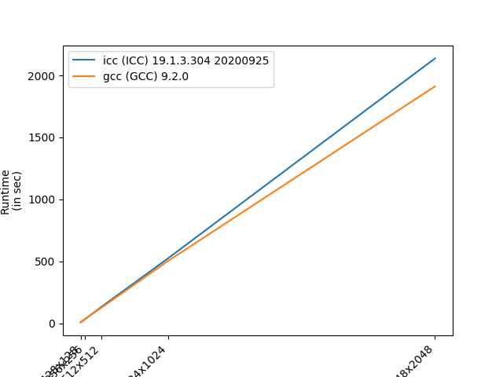

# ICE4131 - High Performance Computing (HPC)
## Week 4: Parallelisation of a simple ray tracer using Pthread
### Tutor: Franck Vidal

## Objectives

In this lab, you'll practice what we've seen in the lecture so far:

1. Based on last week's results, decide which compiler to use.
  1. We can look at the the raw numbers in a spreadsheet, and/or
  2. Plot the data in a graph.
2. Exploit last week's analysis using `gprof` to identify which portion of the code to parallelise.
3. Write the corresponding code using Pthread.
4. For a given image size, run the code on the compute nodes with various numbers of threads.
5. Plot the corresponding graphs.


## Preliminaries

- Go to your `SimpleRayTracing` directory on Supercomputing Wales.
- In case I updated something, pull the new code:
```bash
git pull
```

## Decide which compiler to use

1. Make sure you finished last week's lab.
2. Make sure you've created `runtime.csv`.
3. Look at the content of the file as a spreadsheet.
    - I see some errors in mine, make sure the data in yours is fine (you can delete the rows that show errors)
    - Add a new column `nb pixels`
        - For an 256x256 image, the corresponding value is 65536, i.e. 256 * 256.
        - For an 1024*1024 image, the corresponding value is 1048576, i.e. 1024 * 1024.
        - Process every row.
        - Save the file as a CSV file.
    - answer the following questions:
        - Was `icc` better than `g++`?
        - Was `g++` better than `icc`?
        - Were they as good as each other?
4. To be on the safe size, let's plot the data in a graph (which is why we added the new column).
    - Create a new text file called `plotRuntime.py` that contains:
    ```python
    #!/usr/bin/env python3

    import matplotlib.pyplot as plt # Plotting liplotRuntime.pybrary
    import pandas as pd # Load the CSV file

    # Lad the spreadsheet
    df = pd.read_csv("runtime.csv")

    # Sort by resolution
    df = df.sort_values(by=["nb pixels"])

    # Create a new figure
    plt.figure()

    # Plot the runtime for each compiler
    for compiler in df["Compiler"].unique():
        test = df["Compiler"] == compiler
        plt.plot(df[test]["nb pixels"], df[test]["Runtime in sec"], label=compiler)

    # Add the horizontal and vertical labels
    plt.xlabel("Number of pixels")
    plt.ylabel("Runtime\n(in sec)")


    # Get the horizontal ticks
    xtics_values = []
    xtics_labels = []

    for res in df["nb pixels"].unique():
        test = df["nb pixels"] == res
        xtics_values.append(int(res))
        xtics_labels.append(df[test]["Image size"].values[0])

    # Add the horizontal ticks
    plt.xticks(xtics_values, xtics_labels, rotation=45, ha='right')

    # Add the legend
    plt.legend()    

    # Save the plot
    plt.savefig('runtime-icc_vs_gcc.pdf')
    plt.savefig('runtime-icc_vs_gcc.png')
    ```
    - Load the Python module
    ```bash
    module load python/3.7.0
    ```
    - Make sure matplotlib and pandas are installed
    ```bash
    python3 -m pip install --user pandas matplotlib
    ```
    - Run the script
    ```bash
    python3 plotRuntime.py
    ```
    - Two new files must have been created, `runtime-icc_vs_gcc.pdf` (for your report), and `runtime-icc_vs_gcc.png` (for a website).

    
    - Looking at your new plot, which compiler is the fastest? (find the curve that is the flattest).
    - You should use it from now on!
        - Make sure you called `source env-gnu.sh` or
        - `source env-intel.sh`

## Identify which portion of the code to parallelise

- Last week, you had generated a file called `serial-profiling.txt`.
- Open it on your local machine.
- Open `src/main.cxx` on your local machine too (or from GitHub).
- Using `serial-profiling.txt`, identify which part of the code of `src/main.cxx` that you must parallelise. As we discussed in the lecture, we often look for for loops.

## Write the Pthread code in `CMakeLists.txt`

1. Edit `CMakeLists.txt` and at the end of the file add:

```cmake
set(CMAKE_THREAD_PREFER_PTHREAD TRUE)
find_package(Threads REQUIRED)
```

It looks for the `pthread` library.

2. Add the program:

```cmake
add_executable(main-pthreads src/main-pthreads.cxx)
TARGET_LINK_LIBRARIES (main-pthreads PUBLIC RayTracing ${ASSIMP_LIBRARY} Threads::Threads)
```

This is were we will add the new program.

## Parallelise this step in `main-pthreads.cxx`

**COMPILE OFTEN**

**YOU MAY TEST YOUR CODE ON THE LOGIN NODE, BUT WITH ONLY 2 THREADS, AND A SMALL IMAGE SIZE, e.g. 32x32.**

1. You need to edit `main-pthreads.cxx`. I would copy the content of `main.cxx` into `main-pthreads.cxx`, but be careful, I added some code in the file to help you with the command line.
    - Compile.
    - Test.
2. Work load allocation:
    - Define a structure to store data required by each thread. You can see an example at Lines 9-15 in [chapter4-3-2.cxx](../Lecture-4/chapter4-3-2.cxx). **In your case, the polygon meshes, the light, maybe some other parameters, and the output image have to be accessible from the thread.**
        - Compile.
    - Compute the number of pixels processed by each thread. You can see an example at Lines 45-66 in [chapter4-3-2.cxx](../Lecture-4/chapter4-3-2.cxx) for an example.
        - Compile.
        - Test.
3. Create *T* threads:
    - Use the `pthread_create` function.
    - See the slides from Chapter 4 for an explanation, and
    - See Lines 18, 71-78, & 117-121 in [chapter4-3-3.cxx](../Lecture-4/chapter4-3-3.cxx) for an example.
    - Compile.
4. Wait for all the threads to complete before saving the output image into a file.
    - Use the `pthread_join` function.
    - See the slides from Chapter 4 for an explanation, and
    - See Lines 80-84 in [chapter4-3-4.cxx](../Lecture-4/chapter4-3-4.cxx) for an example.
    - Compile.
5. Write the callback
    - The lines of code corresponding to the most computationally intensive task has to be ported to the callback function.
    - See Lines 15-16, 34-36, 51, 63-64, 91-96, & 127-142 in [chapter4-3-5.cxx](../Lecture-4/chapter4-3-5.cxx) for an example.
    - Compile.
    - Test.

## Run the code on the compute nodes with various numbers of threads

I created a bash script that submit jobs with various numbers of threads.

- Update it. Maybe input your e-mail address at L11.
- By default, `g++` is enabled. If you want to use the Intel compiler, change `env-gnu.sh` at L34 into `env-intel.sh`, and uncomment L40.
- Now, just run the script using
```bash
./submit-pthread.sh
```
It will submit 10 jobs.

When they are all done, we can modify `plotRuntime.py` to plot more data.
