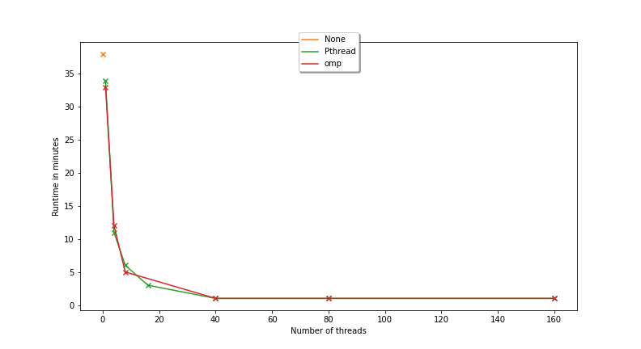
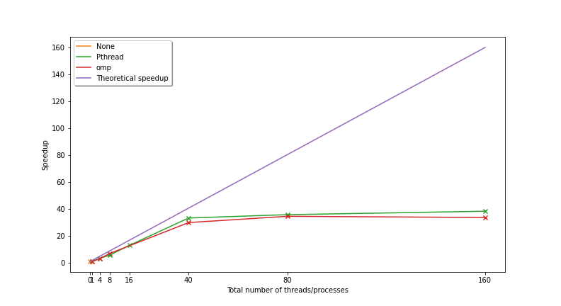

# Objectives

I assume you finished the Pthread code and that you ran it using various numbers of threads. Before you carry on, have you plotted the result of your experiments? We will do that to see the performance of our Pthread implementation. In today's lab, you'll also practice what we've seen in the lecture so far:

1.  Parallelise some serial code using OpenMP (i.e. add OpenMP pragmas),
2.  Run the code on the compute nodes.
<!-- 3.  Plot graphs of runtimes and of speedups to compare the runtimes between Pthread and OpenMP. -->

Some code is provided for your convenience. It is available on GitHub at [https://github.com/effepivi/SimpleRayTracing](https://github.com/effepivi/SimpleRayTracing).
- There is the serial code of a simple ray tracer in `src/main.cxx`.
- You'll add your code in `main-omp.cxx`.

# Getting the latest version of the code

1. Go to your directory on Hawklogin where the code is.
2. In case I changed some of the code or added new file, update the repository using:
```bash
$ git pull
$
```

# Plot the results from last time

- Assuming that all the job completed successfullym run:

```bash
$ cat timing.csv timing-serial-intel-*.csv timing-serial-gnu-*.csv timing-pthread-*.csv > runtime.csv
$
```

- Download `runtime.csv` using your preferred SFTP client, e.g. WinSCP on the lab machines.
- Open the file using MS Excel or equivalent.
- Check if the content is OK.
- Create a new text file called `plotPthread.py` that contains:

```python
#!/usr/bin/env python3

import matplotlib.pyplot as plt # Plotting library
import pandas as pd # Load the CSV file

# Load the spreadsheet
df = pd.read_csv("runtime.csv")

# Sort by number of threads
df = df.sort_values(by=["Number of threads/processes per node"])

# Consider the runs corresponding to Pthread
test_pthread = df["Parallelisation"] == "Pthread"

# Find the resolution that was used the most
resolution = None
resolution_count = 0
for res in df[test_pthread]["Image size"].unique():
    test = df["Image size"] == res
    count = df[test_pthread & test]["Image size"].count()
    if resolution_count < count:
        resolution_count = count
        resolution = res

# Find the image width and image height
width = int(resolution.split('x')[0])
height = int(resolution.split('x')[1])

# Create a new figure
plt.figure()

# Select the rows corresponding to Pthread and the right image resolution
test_res = df["Image size"] == resolution
test = test_res & test_pthread

# Plot the data in min
plt.plot(df[test]["Number of threads/processes per node"],
         df[test]["Runtime in sec"]/60,
         "o-",
         label="Pthread")

# Add the horizontal and vertical labels
plt.xlabel("Number of threads")
plt.ylabel("Runtime\n(in min)")

# Add the legend
plt.legend()    

# Save the plot
plt.savefig('runtime-pthread.pdf')
plt.savefig('runtime-pthread.png')


# Create a new figure
plt.figure()

# Select the rows corresponding to the serial code and of the right image resolution
test_serial = df["Parallelisation"] == "None"
print(df[test_serial & test_res])
serial_runtime = df[test_serial & test_res]["Runtime in sec"].min()

# Plot the speedup factors
plt.plot(df[test]["Number of threads/processes per node"],
         serial_runtime / df[test]["Runtime in sec"],
         "o-",
         label="Pthread")

# Add the horizontal and vertical labels
plt.xlabel("Number of threads")
plt.ylabel("Speedup factor")

# Add the legend
plt.legend()    

# Save the plot
plt.savefig('speedup-pthread.pdf')
plt.savefig('speedup-pthread.png')
```

## Runtime with Pthread


## Speedup with Pthread


# Loading the modules

1. Reuse `env-gnu.sh` from [Lab 3](../LAB3-ray-tracing). It is used to load modules. You need the following modules:
- cmake
- gnuplot
- gcc 9.2.0

**You need to do this EVERY TIME you log in.**

If you can't remember where `env-gnu.sh` is, run the following command to locate where it is:

```bash
$ find ~ -name env-gnu.sh
```

To load the modules using the script, run:

```bash
$ source PATH_TO_ENV/env-gnu.sh
```

(replace `PATH_TO_ENV` with the actual path, as provided by `find ~ -name env.sh`)


2. To check that the modules are loaded, use:

```bash
$ module list
```

# Parallelise the code using OpenMP

Copy/Paste the content of `main.cxx` into `main-omp.cxx`.

## Single for loops

A typical for loop looks like:
```cxx
    for (int i = 0; i < N; i++)
    {
        ...
    }
```

To parallelise it using OpenMP, a compiler instruction has to be specified using `#pragma`:
```cxx
#pragma omp parallel for
    for (int i = 0; i < N; i++)
    {
        ...
    }
```
In this case, the number of threads is automatically detected at runtime. It will corresponds to the number of CPU cores available on the system.

If you want to control the number of threads, add the `num_threads` clause:
```cxx
#pragma omp parallel for num_threads(M)
    for (int i = 0; i < N; i++)
    {
        ...
    }
```
with `M` the number of threads. This is what you have to use in this lab as you want to assess the behaviour of the program depending on the number of threads.

Or use an environment variable: `OMP_NUM_THREADS`. For example, if you type `export OMP_NUM_THREADS=16;` before executing your OpenMP code, only 16 threads will be used.


## Nested loops

Sometimes, we have two nested loops:

```cxx
for (int j = 0; j < height; j++)
{
    for (int i = 0; i < width; i++)
    {
        DO SOMETHING
    }
}
```

The OpenMP collapse clause can be used to parallelise nested loops:

```cxx
#pragma omp parallel for collapse(2)
for (j = 0; j < height; j++)
{
    for (i = 0; i < width; i++)
    {
        DO SOMETHING
    }
}
```
In `collapse(2)`, `2` is used because we have two nested loops.

The OpenMP collapse clause will increase the number of iterations per thread. It will reduce the granularity of work to be done by each thread, which may improve performance.


## Task

1. Add the appropriate OpenMP pragma in `main-omp.cxx`.
2. You must enable the `-fopenmp` option of the compiler. If you don't the pragmas will be ignored by the compiler. In `CMakeLists.txt`:

```cmake
# OpenMP ####################################################################
find_package(OpenMP REQUIRED)

# Program ###############################################################
add_executable(main-omp src/main-omp.cxx)
TARGET_INCLUDE_DIRECTORIES(main-omp PUBLIC ${ASSIMP_INCLUDE_DIRS})
TARGET_LINK_LIBRARIES (main-omp PUBLIC RayTracing ${ASSIMP_LIBRARY})
if(OpenMP_CXX_FOUND)
    TARGET_LINK_LIBRARIES(main-omp PUBLIC OpenMP::OpenMP_CXX)
endif()
```
3. Compile your code.

# Run your program

1. To run your program, launch a job. DO NOT RUN IT DIRECTLY ON `hawklogin.cf.ac.uk`. Be nice to other users!
2. See [Lab 2](../LAB2) for an explanation.
3. I provided a script, [`submit-omp.sh`](../../SimpleRayTracing/submit-omp.sh). Edit this file to use your email address in `echo "##SBATCH --mail-user=YOUREMAILADDRESS@bangor.ac.uk`.
`submit-omp.sh` creates another 8 scripts `submit-omp-*.sh` and submit the jobs with 1, 4, 8, 16, 24, 40, 80 and 160 threads.
For example, the script below `submit-omp-40.sh` is the script used to submit a job with 40 threads.

```bash
#!/usr/bin/env bash
#
#SBATCH -A scw1563                   # Project/Account (use your own)
##SBATCH --mail-user=YOUREMAILADDRESS@bangor.ac.uk  # Where to send mail
#SBATCH --mail-type=END,FAIL         # Mail events (NONE, BEGIN, END, FAIL, ALL)
#SBATCH --job-name=RT-40-omp       # Job name
#SBATCH --output ray_tracing-%j.out  #
#SBATCH --error ray_tracing-%j.err   #
#SBATCH --nodes=1                    # Use one node
#SBATCH --ntasks-per-node=1          # Number of tasks per node
#SBATCH --cpus-per-task=40            # Number of cores per task
#SBATCH --time=00:25:00              # Time limit hrs:min:sec
#SBATCH --mem=600mb                  # Total memory limit
thread_number=40
module purge > /dev/null 2>&1
module load cmake mpi/intel
COMPILER="icc (ICC) 18.0.2 20180210"
TEMP=`lscpu|grep "Model name:"`
IFS=':' read -ra CPU_MODEL <<< "$TEMP"
width=2048
height=2048
echo Run ./main-omp with 40 threads.
export OMP_NUM_THREADS=40
/usr/bin/time --format='%e' ./bin-release-gcc/main-omp --size 2048 2048 --jpeg omp-40-2048x2048.jpg 2> temp-omp-40
RUNTIME=`cat temp-omp-40`
echo ${CPU_MODEL[1]},omp,$thread_number,1,$COMPILER,${width}x$height,$RUNTIME >> timing-omp-40.csv
#rm temp-omp-40
```
4. To launch it, use:
```bash
$ ./submit-omp.sh
```
5. Wait for the job to complete. Use `squeue -u $USER`.

6. When the job is terminated, you'll have new files. Examine their content. Are the JPEG files as expected?

7. To see the new images, download them from `hawklogin.cf.ac.uk` to your PC using WinSCP.

8. Only go to the next section when everything works as expected. If not, debug your code.

# While you wait

Why don't you work on your report ;-)

# Performance evaluation

- Using the same methodology as before, update runtime.csv

```bash
$ cat timing-omp-*.csv >> runtime.csv
$
```

- Copy `plotPthread.py` in a new script `plotPthreadVsOpenMP.py`.

- Update the script to plot two curves, one for Pthread, one for OpenMP.


<!-- 1. A shell script - [createTiming.sh](createTiming.sh) - is provided for your own convenience. It will concatenate the runtimes for all the jobs that completed and create a spreadsheet `timing.csv`.

Below is an example of output I obtained on SCW.

| CPU	| Parallelisation	| Number	of	threads/processes	per	node | Number	of	nodes	| Compiler | Image	size |Runtime	in sec |
|-----|-----------------|----------------------------------------|------------------|----------|-------------|---------------|
Intel(R)	Xeon(R)	Gold	6148	CPU	@	2.40GHz	| None	  | 0 | 1 | icc (ICC) 18.0.2 20180210 | 2048x2048 | 2264.58 |
Intel(R)	Xeon(R)	Gold	6148	CPU	@	2.40GHz	| Pthread	| 160 | 1 | icc (ICC) 18.0.2 20180210 | 2048x2048 | 58.96 |
Intel(R)	Xeon(R)	Gold	6148	CPU	@	2.40GHz	| Pthread	| 16 | 1 | icc (ICC) 18.0.2 20180210 | 2048x2048 | 172.76 |
Intel(R)	Xeon(R)	Gold	6148	CPU	@	2.40GHz	| Pthread	| 1 | 1 | icc (ICC) 18.0.2 20180210 | 2048x2048 | 2066.42 |
Intel(R)	Xeon(R)	Gold	6148	CPU	@	2.40GHz	| Pthread	| 40 | 1 | icc (ICC) 18.0.2 20180210 | 2048x2048 | 67.8 |
Intel(R)	Xeon(R)	Gold	6148	CPU	@	2.40GHz	| Pthread	| 4 | 1 | icc (ICC) 18.0.2 20180210 | 2048x2048 | 650.46 |
Intel(R)	Xeon(R)	Gold	6148	CPU	@	2.40GHz	| Pthread	| 80 | 1 | icc (ICC) 18.0.2 20180210 | 2048x2048 | 63.14 |
Intel(R)	Xeon(R)	Gold	6148	CPU	@	2.40GHz	| Pthread	| 8 | 1 | icc (ICC) 18.0.2 20180210 | 2048x2048 | 389.77 |
Intel(R)	Xeon(R)	Gold	6148	CPU	@	2.40GHz	| omp	    | 160 | 1 | icc (ICC) 18.0.2 20180210 | 2048x2048 | 67.07 |
Intel(R)	Xeon(R)	Gold	6148	CPU	@	2.40GHz	| omp	    | 1 | 1 | icc (ICC) 18.0.2 20180210 | 2048x2048 | 1976.59 |
Intel(R)	Xeon(R)	Gold	6148	CPU	@	2.40GHz	| omp	    | 40 | 1 | icc (ICC) 18.0.2 20180210 | 2048x2048 | 75.5 |
Intel(R)	Xeon(R)	Gold	6148	CPU	@	2.40GHz	| omp	    | 4 | 1 | icc (ICC) 18.0.2 20180210 | 2048x2048 | 693.33 |
Intel(R)	Xeon(R)	Gold	6148	CPU	@	2.40GHz	| omp	    | 80 | 1 | icc (ICC) 18.0.2 20180210 | 2048x2048 | 65.35 |
Intel(R)	Xeon(R)	Gold	6148	CPU	@	2.40GHz	| omp	    | 8 | 1 | icc (ICC) 18.0.2 20180210 | 2048x2048 | 321.3 |

2. Plot the results using Python3 and matplotlib using the script I provided.

```bash
$ module load python/3.7.0
$ python3 -m pip install numpy pandas matplotplib
$ python3 plotTiming.py
```

It creates four files:

- `runtimes.pdf`
- `runtimes.png`
- `speedup.pdf`
- `speedup.png`

For me, it looks like:





What do you conclude from the graphs? Compare the relative speed up provided by both APIs! -->

# Next week

We'll use more than one node at a time using MPI. For me, with 8 nodes, it took only 12 seconds to compute the whole 2048x2048 image. Yes 12 seconds. The serial code takes 45 minutes. That's a speed up of 225x.
