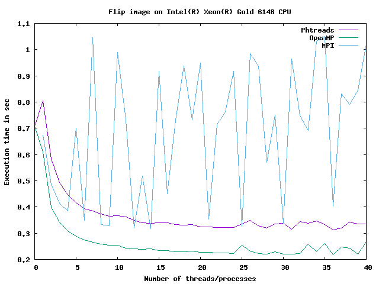
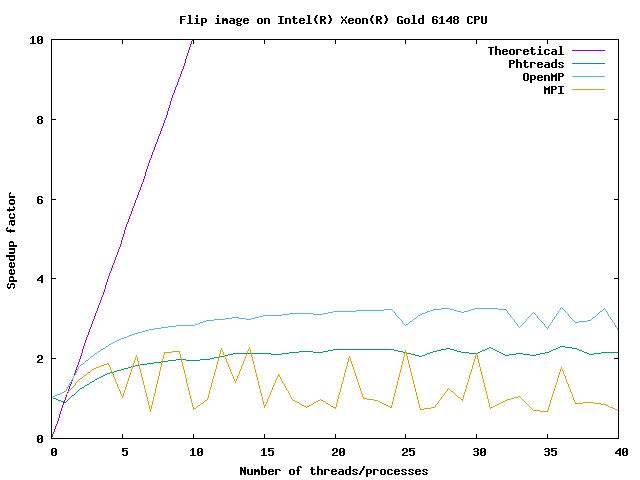
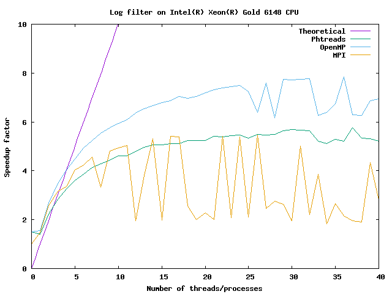

# ICE4131 - High Performance Computing (HPC)
## Lab 5: MPI versus Pthreads versus OpenMP versus serial
### Tutor: Franck Vidal

## Objectives

In this lab, you practice what we've seen in the lecture so far:
1. Compile code implemented using MPI,
2. Run the code using distributed memory,
3. Compare the runtimes between Pthreads, OpenMP and MPI by plotting graphs of runtimes and of speedups.

Some code is provided for your convenience:
- `MPIImage` inherits of `Image`.
- `flip.cxx` and `log.cxx` are two programs making use of the serial code, phtread code, OpenMP, and MPI.
    - Usage: flip -- Flip the input image horizontally or vertically
```bash
        --horizontally
        -H
            Flip the image horizontally
        --vertically
        -V
            Flip the image vertically
        --num <n>
        -n <n>
            Number of threads/processes
        --implementation <string>
        -c <string>
            Choose implementation: serial|pthread|openmp|cuda|mpi
        --inputFile <fname>
        -i <fname>
            Input file to process
        --outputFile <fname>
        -o <fname>
            File to write
        --help
        -h
            Show help
```
    - Usage: log -- Apply a log filter on all the pixels of the input
```bash
        --num <n>
        -n <n>
            Number of threads/processes
        --implementation <string>
        -c <string>
            Choose implementation: serial|pthread|openmp|cuda|mpi
        --inputFile <fname>
        -i <fname>
            Input file to process
        --outputFile <fname>
        -o <fname>
            File to write
        --help
        -h
            Show help
```


<!-- Link to create images of code: https://carbon.now.sh -->


## Getting the code

1. Download the code from Blackboard. The file is `Lab5-20191115.tar.bz2`.
2. Copy this file from your PC to `hawklogin.cf.ac.uk` using WinSCP.
3. Connect to `hawklogin.cf.ac.uk` using a SSH client such as Putty.
4. Create a `LAB5` directory using `mkdir`.
5. Go into `LAB5` using the `cd` command.
6. Extract the archive using:
```bash
$ tar xjvfp ../Lab5-20191115.tar.bz2
```

## Loading the modules

1. Create a new `env.sh` script. It is used to load modules. You need the following modules:
- cmake
- gnuplot
- compiler/gnu/8/1.0
- mpi/openmpi/3.1.1

Make sure no other module is loaded:
```bash
$ module purge
```

Once the script is create, to load the modules using the script, run
```bash
$ source env.sh
```


2. You can use
```bash
$ module list
```
to check that the modules are loaded.

3. Create a `bin` directory using `mkdir`.

4. Go into `bin` using the `cd` command.

5. Configure your project using CMake:
```bash
$ cmake ..
```

6. Compile your code
```bash
$ make
```


## Run your program

1. To run your program, launch a job. DO NOT RUN IT DIRECTLY ON `hawklogin.cf.ac.uk`. Be nice to other users!
2. See [Lab 2](../LAB2) for an explanation.
3. Create a new file named `submit1.sh` containing:
```bash
#!/usr/bin/env bash
#
# Project/Account (use your own)
#SBATCH -A scw1563
#SBATCH --job-name=my_test           # Job name
#SBATCH --nodes=1                    # Use one node
#SBATCH --cpus-per-task=10           # Number of cores per task
#SBATCH --mem=600mb                  # Total memory limit
#SBATCH --time=00:15:00              # Time limit hrs:min:sec

# Clear the environment from any previously loaded modules
module purge > /dev/null 2>&1

# Load the module environment suitable for the job
source env.sh

# Apply the log filter using serial implementation
./bin/log \
    -i ../LAB3/Airbus_Pleiades_50cm_8bit_grey_Yogyakarta.txt \
    -o log_image-serial.txt \
    -c serial

# Apply the log filter using OpenMP implementation
./bin/log \
    -i ../LAB3/Airbus_Pleiades_50cm_8bit_grey_Yogyakarta.txt \
    -o log_image-openmp.txt \
    -n $SLURM_CPUS_PER_TASK \
    -c openmp

# Apply the log filter using Pthread implementation
./bin/log \
    -i ../LAB3/Airbus_Pleiades_50cm_8bit_grey_Yogyakarta.txt \
    -o log_image-pthread.txt \
    -n $SLURM_CPUS_PER_TASK \
    -c pthread

# Apply the log filter using MPI implementation
./bin/log \
    -i ../LAB3/Airbus_Pleiades_50cm_8bit_grey_Yogyakarta.txt \
    -o log_image-MPI.txt \
    -n $SLURM_CPUS_PER_TASK \
    -c MPI

# Flip the image using serial implementation
./bin/flip \
    -H  \
    -i ../LAB3/Airbus_Pleiades_50cm_8bit_grey_Yogyakarta.txt \
    -o flip_image-serial.txt \
    -c serial

# Flip the image using OpenMP implementation
./bin/flip \
    -H  \
    -i ../LAB3/Airbus_Pleiades_50cm_8bit_grey_Yogyakarta.txt \
    -o flip_image-openmp.txt \
    -n $SLURM_CPUS_PER_TASK \
    -c openmp

# Flip the image using Pthread implementation
./bin/flip \
    -H  \
    -i ../LAB3/Airbus_Pleiades_50cm_8bit_grey_Yogyakarta.txt \
    -o flip_image-pthread.txt \
    -n $SLURM_CPUS_PER_TASK \
    -c pthread

# Flip the image using MPI implementation
./bin/flip \
    -H  \
    -i ../LAB3/Airbus_Pleiades_50cm_8bit_grey_Yogyakarta.txt \
    -o flip_image-MPI.txt \
    -n $SLURM_CPUS_PER_TASK \
    -c MPI
```

4. To launch it, use:
```bash
$ sbatch  submit1.sh
```


5. Wait for the job to complete. Use `squeue -u $USER`.

6. When the job is terminated, five new files should be there:
    - `log_image-openmp.txt`,
    - `log_image-pthread.txt`,
    - `log_image-MPI.txt`,
    - `flip_image-openmp.txt`,
    - `flip_image-MPI.txt`,
    - `flip_image-pthread.txt` and
    - `slurm-%j.out`, with %j the job number.

7. Use `more slurm-%j.out` to see the content of the file.

8. To see the new images, download them from `hawklogin.cf.ac.uk` to your PC using WinSCP.

9. Use ImageJ to visualise the image (Import->Text Image)

10. Only go to the next section when everything works as expected. If not, debug your code.

## Performance evaluation

A shell script - [run.sh](run.sh) - is provided for your own convenience. It will launch the programs iteratively using:
- serial implementation,
- Pthread implementation with the number of threads from 1 to 40,
- OpenMP implementation with the number of threads from 1 to 40.
- MPI implementation with the number of processes from 1 to 40.

It will also:
- Create CSV files to gather the execution time,
- Detect the CPU name,
- Create gnuplot scripts,
- Plot graphs with speedup factors, execution times for the log filter and the flip image programs:
    - log_execution_time.png
    - log_speedup.png
    - flip_execution_time.png
    - flip_speedup.png

Edit Line 2 of [run.sh](run.sh) if needed. It has to be the path to the input image.

The figures below show the execution time and speedup for `./flip` and `./log` when I run the `run.sh` script on my office PC (I only used 12 threads here).








**REMEMBER: DON'T RUN `run.sh` DIRECTLY ON HAWKLOGIN.CF.AC.UK!**

To execute the script, use SLURM. A script - [submit2.sh](submit2.sh) is provided:
```bash
#!/usr/bin/env bash
#
# Project/Account
#SBATCH -A scw1563
#
# We ask for 1 task with 40 cores.
# We need one node, just for us.
#
# Number of tasks per node
#SBATCH --ntasks-per-node=1
#
# Number of cores per task
#SBATCH --cpus-per-task=40
#
# Use one node
#SBATCH --nodes=1
#
# Runtime of this jobs is less then 12 hours.
#SBATCH --time=12:00:00

# Clear the environment from any previously loaded modules
module purge > /dev/null 2>&1

# Load the module environment suitable for the job
module load compiler/gnu/9/2.0 gnuplot

# And finally run the job​
./run.sh

# End of submit file
```
As we need 40 tasks (threads in our case), we want to have exclusive access to a compute node. This is what the following does:
```bash
# Number of tasks per node
#SBATCH --ntasks-per-node=1
#
# Number of cores per task
#SBATCH --cpus-per-task=40
#
# Use one node
#SBATCH --nodes=1
```

To submit your job, type:
```bash
$ sbatch submit2.sh
```
It is going to take a lot of time. When I tried it took about 15 minutes.
To check if your job is over, use
```bash
$ squeue -u $USER
```

Below is an example of output I obtained on SCW.


