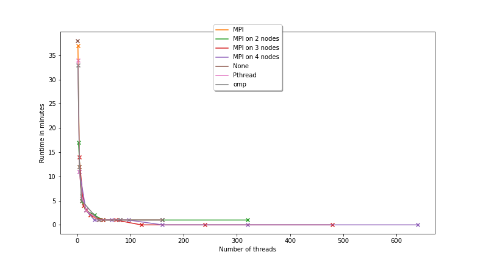
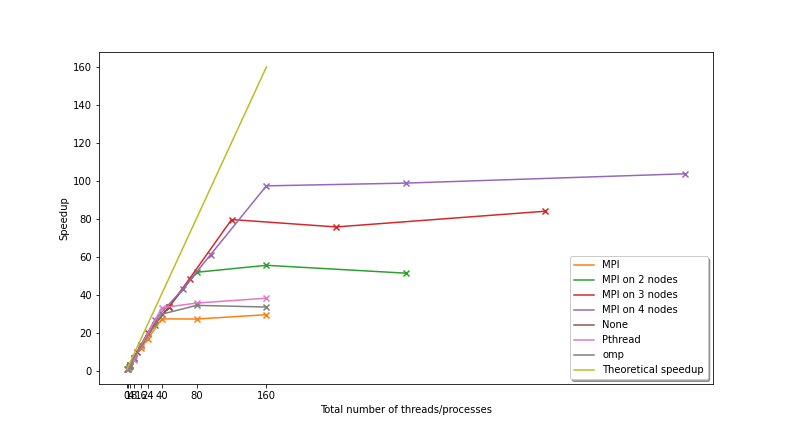

# Objectives

I assume you finished the Pthread code, the OpenMP code and that you ran them using various numbers of threads. In today's lab, you'll use the Message Passing Interface (MPI):

1.  Parallelise some serial code using MPI,
2.  Run the code on the compute nodes: Several computers may be used together to generate a single image, each computer working on a small portion of the whole image,
3.  Plot graphs of runtimes and of speedups to compare the runtimes between Serial code, Pthread, OpenMP and MPI.

Some code is provided for your convenience. It is available on GitHub at [https://github.com/effepivi/SimpleRayTracing](https://github.com/effepivi/SimpleRayTracing).
- There is the serial code of a simple ray tracer in `src/main.cxx`.
- You'll add your code in `main-mpi.cxx`.

# Getting the latest version of the code

1. Go to your directory on Hawklogin where the code is.
2. In case I changed some of the code or added new file, update the repository using:
```bash
$ git pull
$
```

# Loading the modules

1. Reuse `env.sh` from [Lab 3](../LAB3-ray-tracing). It is used to load modules. You need the following modules:
- cmake
- gnuplot
- compiler/intel/2020/2
- mpi/intel

(note the last one)

**You need to do this EVERY TIME you log in.**

If you can't remember where `env.sh` is, run the following command to locate where it is:

```bash
$ find ~ -name env.sh
```

To load the modules using the script, run:

```bash
$ source PATH_TO_ENV/env.sh
```

(replace `PATH_TO_ENV` with the actual path, as provided by `find ~ -name env.sh`)


2. To check that the modules are loaded, use:

```bash
$ module list
```

# Add the new executable in `CMakeLists.txt`

1. Look for MPI
```cmake
find_package(MPI REQUIRED)
```
2. Add the new executable
```cmake
add_executable(main-mpi src/main-mpi.cxx)
```
3. Specify extra header directories
```cmake
TARGET_INCLUDE_DIRECTORIES(main-mpi PUBLIC ${ASSIMP_INCLUDE_DIRS} ${MPI_INCLUDE_PATH})
```
4. The linkage
```cmake
TARGET_LINK_LIBRARIES (main-mpi PUBLIC RayTracing ${ASSIMP_LIBRARY} ${MPI_CXX_LIBRARIES})
```

# Parallelise the code using MPI

Copy/Paste the content of `main.cxx` into `main-mpi.cxx`.

## Header

You must include `<mpi.h>`.

## Initialise MPI

At the begining of the main, you must call:

```cpp
        // Initialise MPI
        MPI_Init(NULL, NULL);
```

## Finalise MPI

Before the `main` exists, you must call:

```cpp
        // End using MPI
        MPI_Finalize();
```

## Saving the final image

Several processes, maybe running on different computers, will collaboarate to generate a single image, each process will work on a small portion of the whole image. Only one of them can write the final image on the disk, the ROOT. You must define a constant global variable, `ROOT`, equal to the rank 0:

```cpp
const int ROOT = 0;
```

In the `main`, find where the final image is saved. Make sure only the `ROOT` will write it:

```cpp
        // Only the master is allowed to save
        if (rank == ROOT)
        {
          output_image.saveJPEGFile(output_file_name);
        }
```

Other processes will not write it.


## Compile your code.

Compile often!

## Workload allocation

From now on, the only function we will modify it renderLoop`. 
The workload allocation is the same as what we saw with Pthread. Instead of threads, we have processes. 
The total number of processes is the world size:

```cpp
    int world_size;
    MPI_Comm_size(MPI_COMM_WORLD, &world_size);
```

The rank of the process is retrieved as follows:

```cpp
    int rank;
    MPI_Comm_rank(MPI_COMM_WORLD, &rank);
```

Each process deals with `elements_per_task` (number of pixels):

```cpp
    unsigned int number_of_pixels = anOutputImage.getWidth() * anOutputImage.getHeight();
    unsigned int elements_per_task = number_of_pixels / world_size;
    unsigned int remainder = number_of_pixels % world_size;
```


Each process must know the index of the first and last pixels it must compute:

```cpp
    int start_id = 0;
    int end_id = number_of_pixels - 1;
    int last_element = -1;
    for (int i = 0; i < world_size; ++i)
    {
        start_id = ++last_element;
        end_id = last_element + element_per_task - 1;

        if (remainder > 0)
        {
            end_id++;
            --remainder;
        }
        last_element = end_id;

        // Exit the method
        if (rank == i) break;
    }
```

## Compile your code.

Compile often!

## Rendering loop

The 2 nested rendering loops must be replaced with a single loop to process the pixels from `start_id` to `end_id`. 
The 2D pixel coordinates are computed from the 1D pixel coordinates:

```cpp
    for (unsigned int id = start_id; id <= end_id; ++id)
    {
        int row = id / anOutputImage.getWidth();
        int col = id % anOutputImage.getWidth();

        [...]
    }
```

## Compile your code.

Compile often!

## Gathering the data from all the processes

If you used 4 processes, the `ROOT` only "knows" the top first quarter of the image. At the end of the `renderLoop` function, it must collect the other 3 quarters from the other processes (that may actually be executed on another computer):

```cpp
    // Master gather results from all the processes
    if (rank == ROOT)
    {
        for (int i = 1; i < world_size; ++i)
        {
            int start_id;
            int end_id;

            MPI_Status status;

            checkMPIError(MPI_Recv(&start_id, 1, MPI_INT, i, 0, MPI_COMM_WORLD, &status));
            checkMPIError(MPI_Recv(&end_id, 1, MPI_INT, i, 1, MPI_COMM_WORLD, &status));
            checkMPIError(MPI_Recv(anOutputImage.getData() + start_id * 3, (end_id - start_id + 1) * 3, MPI_UNSIGNED_CHAR, i, 2, MPI_COMM_WORLD, &status));
        }
    }
    // Other processes send the data to the master
    else
    {
        checkMPIError(MPI_Send(&start_id, 1, MPI_INT, ROOT, 0, MPI_COMM_WORLD));
        checkMPIError(MPI_Send(&end_id,   1, MPI_INT, ROOT, 1, MPI_COMM_WORLD));
        checkMPIError(MPI_Send(anOutputImage.getData() + start_id * 3, (end_id - start_id + 1) * 3, MPI_UNSIGNED_CHAR, ROOT, 2, MPI_COMM_WORLD));
    }
```

Now, you need the code for `checkMPIError`, which makes sure `MPI_Recv` and `MPI_Send` executed without errors:

```cpp

//-------------------------------------
void checkMPIError(int errorCode) const
//-------------------------------------
{
    if (errorCode == MPI_ERR_COMM)
    {
        throw "Invalid communicator. A common error is to use a null communicator in a call (not even allowed in MPI_Comm_rank).";
    }
    else if (errorCode == MPI_ERR_TYPE)
    {
        throw "Invalid datatype argument. Additionally, this error can occur if an uncommitted MPI_Datatype (see MPI_Type_commit) is used in a communication call.";
    }
    else if (errorCode == MPI_ERR_COUNT)
    {
        throw "Invalid count argument. Count arguments must be non-negative; a count of zero is often valid.";
    }
    else if (errorCode == MPI_ERR_TAG)
    {
        throw "Invalid tag argument. Tags must be non-negative; tags in a receive (MPI_Recv, MPI_Irecv, MPI_Sendrecv, etc.) may also be MPI_ANY_TAG. The largest tag value is available through the the attribute MPI_TAG_UB.";
    }
    else if (errorCode == MPI_ERR_RANK)
    {
        throw "Invalid source or destination rank. Ranks must be between zero and the size of the communicator minus one; ranks in a receive (MPI_Recv, MPI_Irecv, MPI_Sendrecv, etc.) may also be MPI_ANY_SOURCE. ";
    }
}
```


# Run your program

1. To run your program, launch a job. DO NOT RUN IT DIRECTLY ON `hawklogin.cf.ac.uk`. Be nice to other users!
2. See [Lab 2](../LAB2) for an explanation.
3. I provided a script, [`submit-mpi.sh`](../../SimpleRayTracing/submit-mpi.sh). Edit this file to use your email address in `echo "##SBATCH --mail-user=YOUREMAILADDRESS@bangor.ac.uk`.
`submit-mpi.sh` creates another 4*8=32 scripts `submit-mpi-*-*.sh` and submit the jobs with 1, 2, 3, and 4 nodes with 1, 4, 8, 16, 24, 40, 80 and 160 processes on each node.

For example, the script below `submit-mpi-4-40.sh` is the script used to submit a job with 40 processes on 4 a total of 160 processes.

```bash
#!/usr/bin/env bash
#
#SBATCH -A scw1563                   # Project/Account (use your own)
##SBATCH --mail-user=YOUREMAILADDRESS@bangor.ac.uk  # Where to send mail
#SBATCH --mail-type=END,FAIL         # Mail events (NONE, BEGIN, END, FAIL, ALL)
#SBATCH --job-name=RT-4-40-MPI       # Job name
#SBATCH --output ray_tracing-%j.out  #
#SBATCH --error ray_tracing-%j.err   #
#SBATCH --nodes=4                    # Use one node
#SBATCH --cpus-per-task=1            # Number of cores per task
#SBATCH --ntasks-per-node=40         # Number of tasks per node
#SBATCH --time=00:25:00              # Time limit hrs:min:sec
#SBATCH --mem=600mb                  # Total memory limit
process_number=40
module purge > /dev/null 2>&1
module load cmake mpi/intel
COMPILER="gcc (GCC) 4.8.5 20150623 (Red Hat 4.8.5-39)"
COMPILER="icc (ICC) 18.0.2 20180210"
TEMP=`lscpu|grep "Model name:"`
IFS=':' read -ra CPU_MODEL <<< "$TEMP"
width=2048
height=2048
echo Run ./main-mpi with 40 processes.
/usr/bin/time --format='%e' mpirun  ./bin-release-gcc/main-mpi --size 2048 2048 --jpeg mpi-4-40-2048x2048.jpg 2> temp-mpi-4-40
RUNTIME=`cat temp-mpi-4-40`
echo ${CPU_MODEL[1]},MPI,$process_number,4,$COMPILER,${width}x$height,$RUNTIME >> timing-mpi-4-40.csv
#rm temp-mpi-4-40
```
4. To launch `submit-mpi.sh`, use:
```bash
$ ./submit-mpi.sh
```
5. Wait for the job to complete. Use `squeue -u $USER`.

6. When the job is terminated, you'll have new files. Examine their content. Are the JPEG files as expected?

7. To see the new images, download them from `hawklogin.cf.ac.uk` to your PC using WinSCP.

8. Only go to the next section when everything works as expected. If not, debug your code.

# Performance evaluation

1. A shell script - [createTiming.sh](createTiming.sh) - is provided for your own convenience. It will concatenate the runtimes for all the jobs that completed and create a spreadsheet `timing.csv`.

Below is an example of output I obtained on SCW.

| CPU	| Parallelisation	| Number	of	threads/processes	per	node | Number	of	nodes	| Compiler | Image	size |Runtime	in sec |
|-----|-----------------|----------------------------------------|------------------|----------|-------------|---------------|
Intel(R)	Xeon(R)	Gold	6148	CPU	@	2.40GHz	| None	  | 0 | 1 | icc (ICC) 18.0.2 20180210 | 2048x2048 | 2264.58 |
Intel(R)	Xeon(R)	Gold	6148	CPU	@	2.40GHz	| Pthread	| 160 | 1 | icc (ICC) 18.0.2 20180210 | 2048x2048 | 58.96 |
Intel(R)	Xeon(R)	Gold	6148	CPU	@	2.40GHz	| Pthread	| 16 | 1 | icc (ICC) 18.0.2 20180210 | 2048x2048 | 172.76 |
Intel(R)	Xeon(R)	Gold	6148	CPU	@	2.40GHz	| Pthread	| 1 | 1 | icc (ICC) 18.0.2 20180210 | 2048x2048 | 2066.42 |
Intel(R)	Xeon(R)	Gold	6148	CPU	@	2.40GHz	| Pthread	| 40 | 1 | icc (ICC) 18.0.2 20180210 | 2048x2048 | 67.8 |
Intel(R)	Xeon(R)	Gold	6148	CPU	@	2.40GHz	| Pthread	| 4 | 1 | icc (ICC) 18.0.2 20180210 | 2048x2048 | 650.46 |
Intel(R)	Xeon(R)	Gold	6148	CPU	@	2.40GHz	| Pthread	| 80 | 1 | icc (ICC) 18.0.2 20180210 | 2048x2048 | 63.14 |
Intel(R)	Xeon(R)	Gold	6148	CPU	@	2.40GHz	| Pthread	| 8 | 1 | icc (ICC) 18.0.2 20180210 | 2048x2048 | 389.77 |
Intel(R)	Xeon(R)	Gold	6148	CPU	@	2.40GHz	| omp	    | 160 | 1 | icc (ICC) 18.0.2 20180210 | 2048x2048 | 67.07 |
Intel(R)	Xeon(R)	Gold	6148	CPU	@	2.40GHz	| omp	    | 1 | 1 | icc (ICC) 18.0.2 20180210 | 2048x2048 | 1976.59 |
Intel(R)	Xeon(R)	Gold	6148	CPU	@	2.40GHz	| omp	    | 40 | 1 | icc (ICC) 18.0.2 20180210 | 2048x2048 | 75.5 |
Intel(R)	Xeon(R)	Gold	6148	CPU	@	2.40GHz	| omp	    | 4 | 1 | icc (ICC) 18.0.2 20180210 | 2048x2048 | 693.33 |
Intel(R)	Xeon(R)	Gold	6148	CPU	@	2.40GHz	| omp	    | 80 | 1 | icc (ICC) 18.0.2 20180210 | 2048x2048 | 65.35 |
Intel(R)	Xeon(R)	Gold	6148	CPU	@	2.40GHz	| omp	    | 8 | 1 | icc (ICC) 18.0.2 20180210 | 2048x2048 | 321.3 |
Intel(R)	Xeon(R)	Gold	6148	CPU	@	2.40GHz	| MPI	    | 1 | 1  | icc (ICC) 18.0.2 20180210 | 2048x2048 |2202.38 |
Intel(R)	Xeon(R)	Gold	6148	CPU	@	2.40GHz	| MPI	    | 4 | 1 | icc (ICC) 18.0.2 20180210 | 2048x2048 |720.06 |
Intel(R)	Xeon(R)	Gold	6148	CPU	@	2.40GHz	| MPI	    | 8 | 1 | icc (ICC) 18.0.2 20180210 | 2048x2048 |325.67 |
Intel(R)	Xeon(R)	Gold	6148	CPU	@	2.40GHz	| MPI	    | 16 | 1 | icc (ICC) 18.0.2 20180210 | 2048x2048 |186.73 |
Intel(R)	Xeon(R)	Gold	6148	CPU	@	2.40GHz	| MPI	    | 24 | 1 | icc (ICC) 18.0.2 20180210 | 2048x2048 |132.65 |
Intel(R)	Xeon(R)	Gold	6148	CPU	@	2.40GHz	| MPI	    | 40 | 1 | icc (ICC) 18.0.2 20180210 | 2048x2048 |82.22 |
Intel(R)	Xeon(R)	Gold	6148	CPU	@	2.40GHz	| MPI	    | 80 | 1 | icc (ICC) 18.0.2 20180210 | 2048x2048 |82.47 |
Intel(R)	Xeon(R)	Gold	6148	CPU	@	2.40GHz	| MPI	    | 160 | 1 | icc (ICC) 18.0.2 20180210 | 2048x2048 |76.11 |
Intel(R)	Xeon(R)	Gold	6148	CPU	@	2.40GHz	| MPI	    | 1 | 2 | icc (ICC) 18.0.2 20180210 | 2048x2048 |1036.4 |
Intel(R)	Xeon(R)	Gold	6148	CPU	@	2.40GHz	| MPI	    | 4 | 2 | icc (ICC) 18.0.2 20180210 | 2048x2048 |324.78 |
Intel(R)	Xeon(R)	Gold	6148	CPU	@	2.40GHz	| MPI	    | 8 | 2 | icc (ICC) 18.0.2 20180210 | 2048x2048 |165.93 |
Intel(R)	Xeon(R)	Gold	6148	CPU	@	2.40GHz	| MPI	    | 16 | 2 | icc (ICC) 18.0.2 20180210 | 2048x2048 |92.71 |
Intel(R)	Xeon(R)	Gold	6148	CPU	@	2.40GHz	| MPI	    | 24 | 2 | icc (ICC) 18.0.2 20180210 | 2048x2048 |67.1 |
Intel(R)	Xeon(R)	Gold	6148	CPU	@	2.40GHz	| MPI	    | 40 | 2 | icc (ICC) 18.0.2 20180210 | 2048x2048 |43.51 |
Intel(R)	Xeon(R)	Gold	6148	CPU	@	2.40GHz	| MPI	    | 80 | 2 | icc (ICC) 18.0.2 20180210 | 2048x2048 |40.65 |
Intel(R)	Xeon(R)	Gold	6148	CPU	@	2.40GHz	| MPI	    | 160 | 2 | icc (ICC) 18.0.2 20180210 | 2048x2048 |43.91 |
Intel(R)	Xeon(R)	Gold	6148	CPU	@	2.40GHz	| MPI	    | 1 | 3 | icc (ICC) 18.0.2 20180210 | 2048x2048 |834.56 |
Intel(R)	Xeon(R)	Gold	6148	CPU	@	2.40GHz	| MPI	    | 4 | 3 | icc (ICC) 18.0.2 20180210 | 2048x2048 |220.49 |
Intel(R)	Xeon(R)	Gold	6148	CPU	@	2.40GHz	| MPI	    | 8 | 3 | icc (ICC) 18.0.2 20180210 | 2048x2048 |111.41 |
Intel(R)	Xeon(R)	Gold	6148	CPU	@	2.40GHz	| MPI	    | 16 | 3 | icc (ICC) 18.0.2 20180210 | 2048x2048 |67.3 |
Intel(R)	Xeon(R)	Gold	6148	CPU	@	2.40GHz	| MPI	    | 24 | 3 | icc (ICC) 18.0.2 20180210 | 2048x2048 |46.46 |
Intel(R)	Xeon(R)	Gold	6148	CPU	@	2.40GHz	| MPI	    | 40 | 3 | icc (ICC) 18.0.2 20180210 | 2048x2048 |28.39 |
Intel(R)	Xeon(R)	Gold	6148	CPU	@	2.40GHz	| MPI	    | 80 | 3 | icc (ICC) 18.0.2 20180210 | 2048x2048 |29.84 |
Intel(R)	Xeon(R)	Gold	6148	CPU	@	2.40GHz	| MPI	    | 160 | 3 | icc (ICC) 18.0.2 20180210 | 2048x2048 |26.91 |
Intel(R)	Xeon(R)	Gold	6148	CPU	@	2.40GHz	| MPI	    | 1 | 4 | icc (ICC) 18.0.2 20180210 | 2048x2048 |644.83 |
Intel(R)	Xeon(R)	Gold	6148	CPU	@	2.40GHz	| MPI	    | 4 | 4 | icc (ICC) 18.0.2 20180210 | 2048x2048 |166.67 |
Intel(R)	Xeon(R)	Gold	6148	CPU	@	2.40GHz	| MPI	    | 8 | 4 | icc (ICC) 18.0.2 20180210 | 2048x2048 |83.67 |
Intel(R)	Xeon(R)	Gold	6148	CPU	@	2.40GHz	| MPI	    | 16 | 4 | icc (ICC) 18.0.2 20180210 | 2048x2048 |52.54 |
Intel(R)	Xeon(R)	Gold	6148	CPU	@	2.40GHz	| MPI	    | 24 | 4 | icc (ICC) 18.0.2 20180210 | 2048x2048 |36.93 |
Intel(R)	Xeon(R)	Gold	6148	CPU	@	2.40GHz	| MPI	    | 40 | 4 | icc (ICC) 18.0.2 20180210 | 2048x2048 |23.23 |
Intel(R)	Xeon(R)	Gold	6148	CPU	@	2.40GHz	| MPI	    | 80 | 4 | icc (ICC) 18.0.2 20180210 | 2048x2048 |22.89 |
Intel(R)	Xeon(R)	Gold	6148	CPU	@	2.40GHz	| MPI	    | 160 | 4 | icc (ICC) 18.0.2 20180210 | 2048x2048 |21.81 |


2. Plot the results using Python3 and matplotlib using the script I provided.

```bash
$ module load python/3.7.0
$ python3 -m pip install numpy pandas matplotplib
$ python3 plotTiming.py
```

It creates four files:

- `runtimes.pdf`
- `runtimes.png`
- `speedup.pdf`
- `speedup.png`

For me, it looks like:





What do you conclude from the graphs? Compare the relative speed up provided by both APIs!

