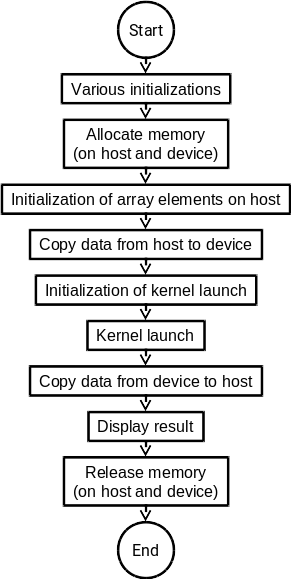

# ICE4131 - High Performance Computing (HPC)
## Lab 7: Write your own C/C++ and CUDA code
### Tutor: Franck Vidal

## Objectives

<!-- Link to create images of code: https://carbon.now.sh -->
- Create our first CUDA program from scratch


## Preparing the code repository

1. Create a new directory for this lab, you can call it `LAB7`.
2. Go into this new directory.
3. Create a new `env.sh` script (you can use `nano env.sh` for this purpose). It is used to load modules. You need the following modules:
- cmake
- compiler/gnu/8/1.0
- **CUDA/10.1**

Make sure no other module is loaded:
```bash
$ module purge
```

Once the script is created, run the following command to load the modules using the script
```bash
$ source env.sh
```
4. Write your own `CMakeLists.txt` file:
```cmake
cmake_minimum_required (VERSION 3.1)
project (ICE4131-Lab7)

# Enable C++ 11
set (CMAKE_CXX_STANDARD 11)
set(CMAKE_CXX_STANDARD_REQUIRED ON)

# Find CUDA
find_package(CUDA REQUIRED)

# Our CUDA program
cuda_add_executable(example1 example1.cu)
```
5. Create the file that will contain the source code, e.g. using `touch example1.cu`
6. Create a `bin` directory
7. Go into the `bin` directory
8. Configure your project using CMake:
```bash
$ cmake ..
```

## Structure of a typical CUDA program

1. Header inclusion
2. Declarations (functions, global variables, etc.)
3. Initialize
4. Memory Allocation
5. Copy memories from CPU (host) to GPU (device)
6. Launch Kernel
7. Copy memories from device to host, i.e. retrieve the result of the computations on the GPU
8. Release the memory




## Example 1

- Create two arrays of 4096 float elements
    - Initialize elements of the arrays using random numbers between 0 and 255;
- Element-wise sum of the arrays;
- Motivation for this example:
    - Create our first CUDA program from scratch;
- We will edit `example1.cu` to implement the flowchart above.


## Header Inclusion

Below are the CUDA headers:

```cpp
//    Include
#include <algorithm>

#include <stdio.h>

#include <cuda.h>             // Main cuda header for low-level driver API
#include <cuda_runtime_api.h> // Main cuda header for high-level runtime
                              //   programming in C
#include <cuda_runtime.h>     // Main cuda header for high-level programming
                              //   in C++
#include <cutil_math.h>       // This file is no part of CUDA API.
                              //   It is provided by the SDK. It implements
                              //   common mathematical operations on vector
                              //   types (float3, float4 etc.).The syntax is
                              //   modelled on the Cg standard library.
```

In `example1.cu`, add the main CUDA header for high-level runtime programming in C. Also add `iostream`.


## Declarations

A given function can be executed on the *host* (CPU), on the *device* (GPU), our on both.

|  | Executed on the: | Only callable from the: |
|-------------------------------|------------------|-------------------------|
| `__host__   float HostFunc()` | host | host |
| `__global__ void  KernelFunc()` | device | host |
| `__device__ float DeviceFunc()` | device | device |

- `__global__` defines a kernel function
    - Must return void
- `__device__` and `__host__` can be used together
- `__global__` and `__device__` functions are C functions with some restrictions:
    - `__device__` functions cannot have their address taken
    - For functions executed on the device:
        - No recursion
        - No static variable declarations inside the function
        - No variable number of arguments

In  `example1.cu` declare the following functions:
```cpp
//    Function declarations
__global__ void Kernel1(float* apOutputData, // The output
                        float* apInputData0, // The 1st input
                        float* apInputData1, // The 2nd input
                        int aWidth); // The number of elements

void initializeArray(float* apArray);
void cleanup();
void checkCudaError(const char* aFileName,
                    const char* aFunctionName,
                    unsigned int aLineNumber);
```

We will also use the following global variables:

```cpp
// Constant variables
const unsigned int WIDTH    = 4096;

//    Global variables
float* g_p_host_float_set0   = NULL;
float* g_p_host_float_set1   = NULL;
float* g_p_host_float_set2   = NULL;
float* g_p_device_float_set0 = NULL;
float* g_p_device_float_set1 = NULL;
float* g_p_device_float_set2 = NULL;
```


## CUDA error checks

It is possible to ask the CUDA driver what is the last CUDA error that occurred with `cudaGetLastError()`. It should return `cudaSuccess`. If it does not, the error code can be converted into an error message. At the end of the file, add the definition of the `checkCudaError` function:
```cpp
//--------------------------------------------
void checkCudaError(const char* aFileName,
                    const char* aFunctionName,
                    unsigned int aLineNumber)
//--------------------------------------------
{
    // Get the latest CUDA error.
    cudaError_t error_code = cudaGetLastError();

    // A CUDA error has occured.
    if (error_code != cudaSuccess)
    {
        // Display an error message in the console.
        fprintf(stderr, "CUDA error: %s\n\tin file: %s\n\tin function%s\n\tat line: %i.",
            cudaGetErrorString(error_code),
            aFileName, aFunctionName, aLineNumber);

        // Quit the program.
        exit(EXIT_FAILURE);
    }
}
```


## Cleaning up the memory

Before we worry about the program itself, we will make sure the memory is freed on the host and device.
The global variables declared above, i.e. `g_p_host_float_set0`,
`g_p_host_float_set1` and `g_p_host_float_set2` on the host, and `g_p_device_float_set0`, `g_p_device_float_set1` and `g_p_device_float_set2` on the device, need to be freed is necessary.
On the device `cudaFree(...)` frees an object from the device *Global Memory*, with `...` the corresponding pointer.
Add the corresponding definition of the `cleanup` function:
```cpp
//------------
void cleanup()
//------------
{
    // Release memory
    printf( "Release memory if needed.\n");

    // Free host memory
    if (g_p_host_float_set0)
    {
        delete [] g_p_host_float_set0;
        g_p_host_float_set0 = NULL;
    }
    if (g_p_host_float_set1)
    {
        delete [] g_p_host_float_set1;
        g_p_host_float_set1 = NULL;
    }
    if (g_p_host_float_set2)
    {
        delete [] g_p_host_float_set2;
        g_p_host_float_set2 = NULL;
    }

    // Free device memory
    if (g_p_device_float_set0)
    {
        cudaFree(g_p_device_float_set0);
        g_p_device_float_set0 = NULL;
    }
    if (g_p_device_float_set1)
    {
        cudaFree(g_p_device_float_set1);
        g_p_device_float_set1 = NULL;
    }
    if (g_p_device_float_set2)
    {
        cudaFree(g_p_device_float_set2);
        g_p_device_float_set2 = NULL;
    }
}
```


## Initialisation

We can now work on the main function and the initialisations.
Add an empty main function to `example1.cu`. Make sure that the main returns 0.

1. Register an exit callback to make sure that the memory is released in case the program stops due to an error:
```cpp
    atexit(cleanup);
```
2. Make sure there is at least one CUDA device:
```cpp
    int device_count;
    cudaGetDeviceCount(&device_count);
    checkCudaError(__FILE__, __FUNCTION__, __LINE__);
```
3. If there is no CUDA device, return an error (e.g. 1):
```cpp
    // There is no device
    if (!device_count)
    {
        std::cerr << "There is no CUDA device on this system. The program will terminate." << std::endl;
        return 1;
    }
```

## Memory allocation

`cudaMalloc(...)` allocates an object in the device *Global Memory*. It requires two parameters:

    - Address of a pointer to the allocated object
    - Size of allocated object

Add the corresponding memory allocation in your main function:

```cpp
    // Compute the size of the array in number of bytes
    unsigned int array_size = WIDTH * sizeof(float);

    // Allocate the memory on host
    g_p_host_float_set0 = new float[WIDTH];
    g_p_host_float_set1 = new float[WIDTH];
    g_p_host_float_set2 = new float[WIDTH];

    // Allocate the memory on device
    cudaMalloc((void**) &g_p_device_float_set0, array_size);
    cudaMalloc((void**) &g_p_device_float_set1, array_size);
    cudaMalloc((void**) &g_p_device_float_set2, array_size);
    checkCudaError(__FILE__, __FUNCTION__, __LINE__);
```


## Data initialisation on the host

`g_p_host_float_set0` and `g_p_host_float_set1` should contain random numbers between 0 and 255. To get a pseudo-rando numder between 0 and 255 in C, we use:

```cpp
floor(255.0f * (float)rand() / (float)RAND_MAX);
```

- `rand` is declare in the `stdlib.h` header file in C, and `cstdlib` in C++. Make sure you include one of these two header files.
- `floor` is declare in the `math.h` header file in C, and `cmath` in C++.
Make sure you include one of these two header files

Add the following definition:

```cpp
//----------------------------------
void initializeArray(float* apArray)
//----------------------------------
{
    for (unsigned int i = 0; i < WIDTH; ++i)
    {
        apArray[i] = floor(255.0f * (float)rand() / (float)RAND_MAX);
    }
}
```

and call this function in the main:
```cpp
    // Initialize random number generator
    srand(time(NULL));

    // Initialize host memory using random numbers
    initializeArray(g_p_host_float_set0);
    initializeArray(g_p_host_float_set1);
```

- `srand` is declare in the `stdlib.h` header file in C, and `cstdlib` in C++. Make sure you include one of these two header files.
- `time(NULL)` is declare in the `time.h` header file in C, and `ctime` in C++. Make sure you include one of these two header files.

**MAKE SURE YOU COMPILE AND TEST YOUR CODE OFTEN**

## CUDA data transfer

The data is now ready to be loaded on the device from the host.
It is done with `cudaMemcpy(...)`. It requires four parameters

- Pointer to destination
- Pointer to source
- Number of bytes copied
- Type of transfer
    - Host to Host
    - Host to Device
    - Device to Host
    - Device to Device
`cudaMemcpy` transfers the data synchronously.

In your main, transfer the data from `g_p_host_float_set0` and `g_p_host_float_set1` to `g_p_device_float_set0` and `g_p_device_float_set1` respectively:

```cpp
    // Copy host memory to device memory
	cudaMemcpy(g_p_device_float_set0, g_p_host_float_set0, array_size, cudaMemcpyHostToDevice);
	cudaMemcpy(g_p_device_float_set1, g_p_host_float_set1, array_size, cudaMemcpyHostToDevice);
	checkCudaError(__FILE__, __FUNCTION__, __LINE__);
```

**MAKE SURE YOU COMPILE AND TEST YOUR CODE OFTEN**


## Kernel Configuration

It some ways, it corresponds to the workload allocation for the threads on CPUs. In CUDA, we need to define how many blocks we want, and how threads per block we need.
There are 4096 elements in the arrays.
I want 256 threads per blocks.

```cpp
// Configure the kernel
int   DimBlock = 256; // 256 threads per block
int   DimGrid  =  WIDTH / DimBlock;

// Make sure there are enough blocks
if (!(WIDTH % DimBlock)) ++DimGrid;
```

**MAKE SURE YOU COMPILE AND TEST YOUR CODE OFTEN**


## Run the kernel

```cpp
    // Run the kernel
	Kernel1<<< DimGrid, DimBlock >>>(g_p_device_float_set2,
		g_p_device_float_set0, g_p_device_float_set1, WIDTH);
	cudaDeviceSynchronize();
	checkCudaError(__FILE__, __FUNCTION__, __LINE__);
```

The definition of the kernel is as follows:

```cpp
//------------------------------------------
__global__ void Kernel1(float* apOutputData,
                        float* apInputData0,
                        float* apInputData1,
                        int aWidth)
//------------------------------------------
{
	// Get element index
	int i = blockDim.x * blockIdx.x + threadIdx.x;

    // i is a valid index
    if (i < aWidth)
    	// Element-wise sum
    	apOutputData[i] = apInputData0[i] + apInputData1[i];
}
```

`__global__` means that the function is the kernel called from the host and executed on the device.

**MAKE SURE YOU COMPILE AND TEST YOUR CODE OFTEN**


## Retrieve the Result from the GPU

```cpp
    // Retrieve the result
    cudaMemcpy(g_p_host_float_set2, g_p_device_float_set2, array_size,
        cudaMemcpyDeviceToHost);
    CheckCudaError(__FILE__, __FUNCTION__, __LINE__);

    // Display the results
    for (unsigned int i = 0; i < WIDTH; ++i)
    {
        printf("%i:\t%f + %f = %f\n",
            i,
            g_p_host_float_set0[i],
            g_p_host_float_set1[i],
            g_p_host_float_set2[i]);

    }
```


## Execute your program

1. To run your program, launch a job. DO NOT RUN IT DIRECTLY ON `hawklogin.cf.ac.uk`. Be nice to other users!
3. Go back to the parent directory (i.e. `LAB7`) using
```bash
$ cd ..
```
4. Create a new file named `submit.sh` containing:

**REMEMBER: DON'T RUN `example1` DIRECTLY ON HAWKLOGIN.CF.AC.UK!**

To execute the script, use SLURM. A script - [submit.sh](submit.sh) is provided:
```bash
#!/usr/bin/env bash
#
# Project/Account (use your own)
#SBATCH -A scw1563
#
# We ask for 1 tasks with 1 core only.
# We ask for a GPU
#SBATCH --gres=gpu:2
#SBATCH -p gpu
#
# Number of tasks per node
#SBATCH --ntasks-per-node=1
#
# Number of cores per task
#SBATCH --cpus-per-task=1
#
# Use one node
#SBATCH --nodes=1
#
# Runtime of this jobs is less then 1 minute.
#SBATCH --time=00:01:00

# Clear the environment from any previously loaded modules
module purge > /dev/null 2>&1

# Load the module environment suitable for the job
source env.sh

# And finally run the job​
./bin/example1

# End of submit file
```


To submit your job, type:
```bash
$ sbatch submit.sh
```
To check if your job is over, use
```bash
$ squeue -u $USER
```


## Adding CUDA events

We want to know how much time is spent

1. transferring data from the host to device, and
2. vice-versa, and
3. how much time is spent processing the arrays.

Add the following local variables in the main function:

```cpp
    float host2device_memcpy_in_ms  = 0;
    float device2host_memcpy_in_ms  = 0;
    float kernel_execution_in_ms    = 0;
```

We need to create two CUDA events. In the main function, after making sure that there is at least one CUDA device, add:

```cpp
    cudaEvent_t start, stop;
    cudaEventCreate(&start);
    cudaEventCreate(&stop);
```

1. Just before copying the data from the host to the device:
    - record an event using `cudaEventRecord(start);` and
2. Just after copying the data from the host to the device,
    - record an event using `cudaEventRecord(st);`
3. Compute the corresponding elapsed time using `    cudaEventElapsedTime(&host2device_memcpy_in_ms, start, stop);`
4. Perform the same steps for
    - `g_kernel_execution_in_ms` (make sure you call `cudaEventRecord(stop)` after `cudaDeviceSynchronize()`), and
    - `device2host_memcpy_in_ms`,
5. Don't forget to destroy the events in the main:

```cpp
    cudaEventDestroy(start);
    cudaEventDestroy(stop);
```

6. Display the elapsed times at the end of the main function:
```cpp
    float total_time = host2device_memcpy_in_ms + device2host_memcpy_in_ms + kernel_execution_in_ms;

    std::cout << "memcpy from host to device: " <<
        host2device_memcpy_in_ms << "ms. " <<
        100.0 * host2device_memcpy_in_ms / total_time << "% of total time" <<
        std::endl;

    std::cout << "memcpy from device to host: " <<
        device2host_memcpy_in_ms << "ms. " <<
        100.0 * device2host_memcpy_in_ms / total_time << "% of total time" <<
        std::endl;

    std::cout << "Kernel exectution: " <<
        kernel_execution_in_ms << "ms. " <<
        100.0 * kernel_execution_in_ms / total_time << "% of total time" <<
        std::endl;
```

**MAKE SURE YOU COMPILE AND TEST YOUR CODE OFTEN**
